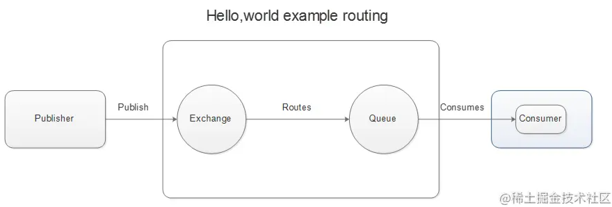

# 几款MQ产品比较。

||RabbitMQ|ActiveMQ|RocketMQ|Kafka|
|--|--|--|--|--|
| 公司社区 | Rabbit|Apache  |  阿里| Apache |
| 开发语言 | Erlang|Java  |  Java| Scala&Java |
|协议支持|AMQP,XMPP,SMTP,STOMP|OpenWire,STOMP，REST,XMPP,AMQP|自定义|自定义协议,社区封装了 http协议支持|
|客户端支持语言|官方支持Erlang,Java,Ruby等,社区产出多种API,几乎支持所有语言|Java，C，C++， Python,PHP,Perl,.net等|Java,C++|官方支持Java,社区产出多种API,如PHP,Python等|
| 单机吞吐量 | 万级（其次）|万级（最差）  |十万级（最好）|十万级（次之） |
| 消息延迟 | 微妙级|毫秒级  |  毫秒级| 毫秒以内 |
| 功能特性 |并发能力强,性能极其好,延时低,社区活跃,管理界面丰富|老牌产品,成熟度高,文档较多|MQ功能比较完备,扩展性佳|只支持主要的MQ功能,毕竟是为大数据领域准备的|

1. ActiveMQ 是Apache出品，最流行的，能力强劲的开源消息总线。它是一个完全支持JMS规范的的消息中间件。丰富的API,多种集群架构模式让ActiveMQ在业界成为老牌的消息中间件,在中小型企业颇受欢迎!
 ​
2. Kafka是LinkedIn开源的分布式发布-订阅消息系统，目前归属于Apache顶级项目。Kafka主要特点是基于Pull的模式来处理消息消费，追求高吞吐量，一开始的目的就是用于日志收集和传输。适合产生大量数据的互联网服务的数据收集业务。
 ​
3. RocketMQ是阿里开源的消息中间件，它是纯Java开发，具有高吞吐量、高可用性、适合大规模分布式系统应用的特点。RocketMQ思路起源于Kafka，但并不是Kafka的一个Copy，它对消息的可靠传输及事务性做了优化，目前在阿里集团被广泛应用于交易、充值、流计算、消息推送、日志流式处理、binglog分发等场景。
 ​
4. RabbitMQ是使用Erlang语言开发的开源消息队列系统，基于AMQP协议来实现。AMQP的主要特征是面向消息、队列、路由（包括点对点和发布/订阅）、可靠性、安全。AMQP协议更多用在企业系统内对数据一致性、稳定性和可靠性要求很高的场景，对性能和吞吐量的要求还在其次。
         
RabbitMQ比Kafka可靠，Kafka更适合IO高吞吐的处理，一般应用在大数据日志处理或对实时性（少量延迟），可靠性（少量丢数据）要求稍低的场景使用，比如ELK日志收集。

## AMQP

AMQP，即 Advanced Message Queuing Protocol（高级消息队列协议），是一个网络协议，是应用层协议的一个开放标准，为面向消息的中间件设计。基于此协议的客户端与消息中间件可传递消息，遵循此协议，不受客户端和中间件产品和开发语言限制。2006年，AMQP规范发布。类比HTTP。

## JMS

因为消息服务在各类应用程序中非常有用，所以JavaEE专门定义了JMS规范。注意到JMS是一组接口定义，如果我们要使用JMS，还需要选择一个具体的JMS产品。常用的JMS服务器有开源的ActiveMQ，商业服务器如WebLogic、WebSphere等也内置了JMS支持。

从官网下载ActiveMQ时，蹦出一个页面，让我们选择ActiveMQ Classic或者ActiveMQ Artemis，这两个是什么关系，又有什么区别？

实际上ActiveMQ Classic原来就叫ActiveMQ，是Apache开发的基于JMS 1.1的消息服务器，目前稳定版本号是5.x，而ActiveMQ Artemis是由RedHat捐赠的HornetQ服务器代码的基础上开发的，目前稳定版本号是2.x。和ActiveMQ Classic相比，Artemis版的代码与Classic完全不同，并且，它支持JMS 2.0，使用基于Netty的异步IO，大大提升了性能。此外，Artemis不仅提供了JMS接口，它还提供了AMQP接口，STOMP接口和物联网使用的MQTT接口。选择Artemis，相当于一鱼四吃。

## AMQP和JMS的区别

- JMS是定义了统一的接口，来对消息操作进行统一；
- AMQP是通过规定协议来统一数据交互的格式 JMS限定了必须使用Java语言；AMQP只是协议，不规定实现方式，因此是跨语言的。
- JMS规定了两种消息模式；而AMQP的消息模式更加丰富

