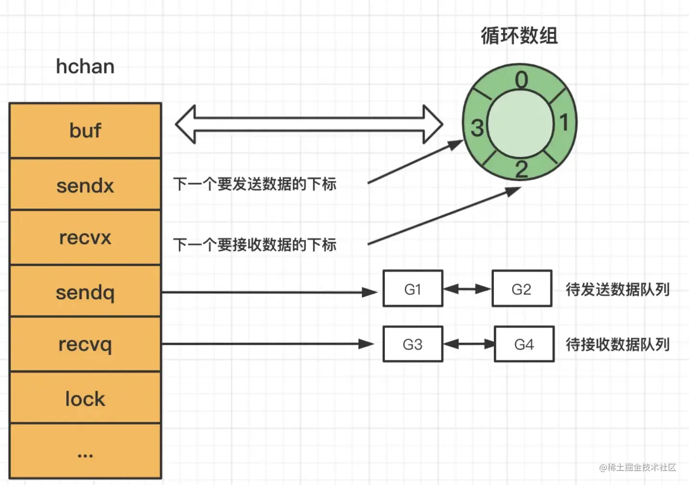

# 通道操作结果表


||nil|channel buf为空|channel buf已满|channel buf未满且不为空|channel已关闭|
|--|--|--|--|--|--|
|receive|阻塞|阻塞|读取成功|读取成功|读取关闭时缓存的数据|
|send|阻塞|写入成功|阻塞|写入成功|panic|
|close|panic|关闭成功，buf中没有缓存数据|关闭成功，保留已经缓存的数据|关闭成功，保留已经缓存的数据|panic|

# channel结构体
```go
type hchan struct {
    qcount   uint           // total data in the queue
    dataqsiz uint           // size of the circular queue
    buf      unsafe.Pointer // points to an array of dataqsiz elements
    elemsize uint16
    closed   uint32
    elemtype *_type // element type
    sendx    uint   // send index
    recvx    uint   // receive index
    recvq    waitq  // list of recv waiters
    sendq    waitq  // list of send waiters

    // lock protects all fields in hchan, as well as several
    // fields in sudogs blocked on this channel.
    //
    // Do not change another G's status while holding this lock
    // (in particular, do not ready a G), as this can deadlock
    // with stack shrinking.
    lock mutex
}
```



过程详解

channel的入队与出队操作都是都是加锁的，以此来保证并发安全。
当队列满了再插入数据时，插入线程g会进入wait状态并且挂在sendq队列上，等取出元素时会将其唤醒，空队取元素同理